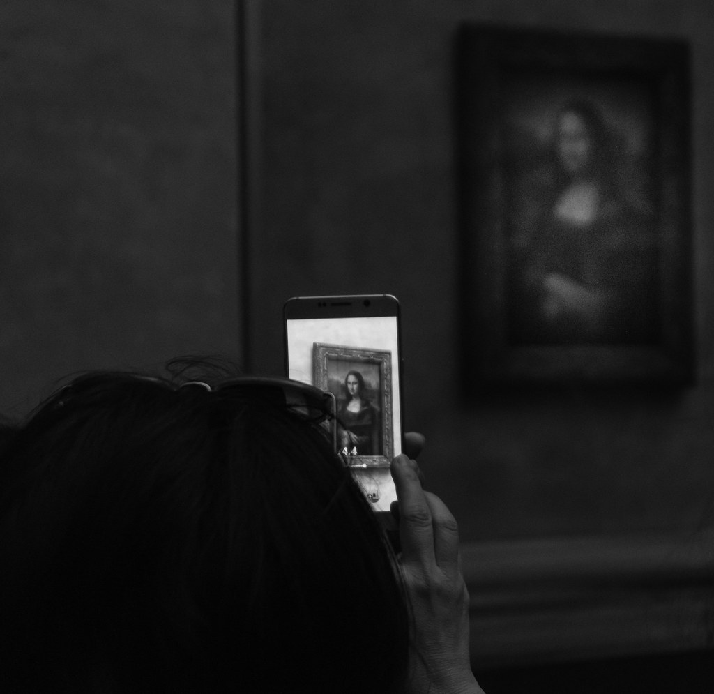
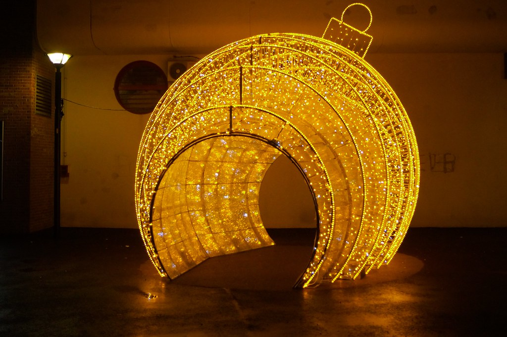

# A few things that I like to do and that passionate me outside of research :D
---

## Visiting U.S. National Parks
While I was living in Chicago, I became passionate about exploring the american national parks. I believe they truly are <a href="https://en.wikipedia.org/wiki/The_National_Parks:_America%27s_Best_Idea">America's best idea</a>. They both protect unique landscapes and biodivesrsity but also allow easy access to everyday people.
My favorite is **Mount Rainier** by a wide margin. I still have in my head the images of the hikes surronded by wildflowers and groundhogs. Then come **Zion**, **Yellowstone**, and **Arches**. Below is a map of the continental U.S. with a pin on every national park I’ve visited so far, you can hover pins for the park's name.

<link rel="stylesheet" href="https://unpkg.com/leaflet@1.9.4/dist/leaflet.css"/>

---

## Games Done Quick Commentary
I’ve contributed as a **commentator for GDQ events** on the french re-stream.
GDQ (or Games Done Quicks) are a nonprofit organization organizing speedruning events to raise money for charity causes.  
They gather hundreds of gamers who show off their skills by completing games quickly. In an effort to make this event accessible to non-English speakers, the French restream commentates in French every year on the gamers' runs. I was fortunate enough to be selected to participate in a few of them.
I have participated as a commentator in the following editions:
- SGDQ 2023
- AGDQ 2020
- SGDQ 2019
- AGDQ 2019
- SGDQ 2018
- SGDQ 2017

---

## Summer Camp Leadership
I worked as a **summer camp leader** while I was a student, organizing for kids outdoor activities, team challenges, and creative workshops.  
I have worked at summer camps run by IGESA, AVEA, Wakanga and Djuringa. I also worked as a camp leader at primary schools in Elancourt and Versailles during the summer holidays.

---

## Photography
I (used to) regularly participate in photography contests, and I have **won three competitions**.  

Here are some of my winning shots:

{: .img-fluid }
{: .img-fluid }

---

## Volonteer Guide in Bordeaux
I really love the city of Bordeaux and, after finding out more about it, I decided to become a Greeter there.
A Greeter brings tourists on completely free walks around the city in small groups, showing them around, explaining things and just having a good time chatting with them.
More importantly, it is a completely free activity, as we Greeters are not guides and thus do not claim any monetary benefit.
Below is a route I usually take people on to show them the city:

{: .img-fluid }

---
