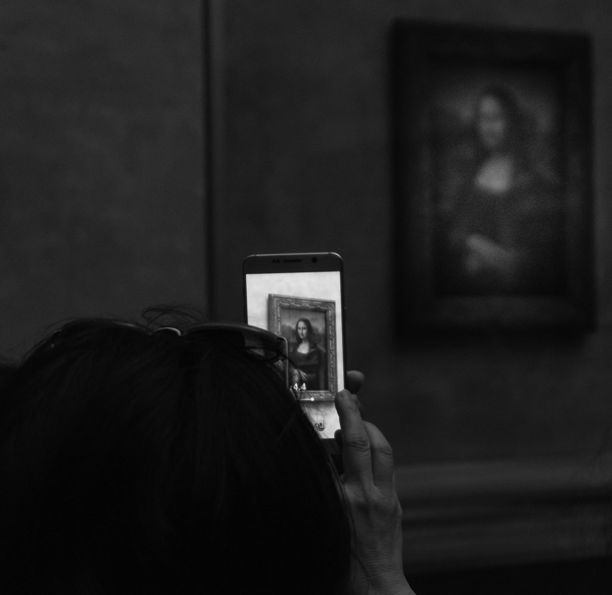
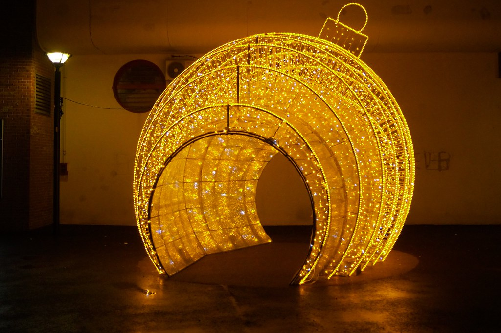

# A few things I'm passionate about outside of research :D
---

## Visiting U.S. National Parks
While living in Chicago I got hooked on the American national parks. They really are <a href="https://en.wikipedia.org/wiki/The_National_Parks:_America%27s_Best_Idea">America's best idea</a>: they protect unique landscapes and biodiversity, and they stay open to everyone.
My favorite is Mount Rainier by a wide margin, for the hikes surrounded by wildflowers and groundhogs. Then come Zion, Yellowstone and Arches. Below is a pin for every park I've visited so far: hover one for its name.

<link rel="stylesheet" href="https://unpkg.com/leaflet@1.9.4/dist/leaflet.css"/>

---

## Games Done Quick Commentary
Games Done Quick is a nonprofit that runs speedrunning marathons to raise money for charity, gathering hundreds of players who finish games as fast as they can.
To make the event accessible to non-English speakers, a French restream commentates the runs every year, and I was lucky enough to be picked as a commentator for a few editions:
- SGDQ 2023
- AGDQ 2020
- SGDQ 2019
- AGDQ 2019
- SGDQ 2018
- SGDQ 2017

---

## Summer Camp Leadership
As a student I worked as a summer camp leader, organizing outdoor activities, team challenges and creative workshops for kids.
I did this at camps run by IGESA, AVEA, Wakanga and Djuringa, and at primary schools in Elancourt and Versailles during the summer holidays.

---

## Photography
I used to enter photography contests regularly, and won three of them. Here are some of the winning shots:

{: .img-fluid }
{: .img-fluid }

---

## Volunteer Guide in Bordeaux
I love Bordeaux, so I became a Greeter there. A Greeter takes small groups of visitors on free walks around the city, showing them around and chatting along the way. We are not professional guides and take no money for it.
Here is the route I usually walk people through:

{: .img-fluid }

---
